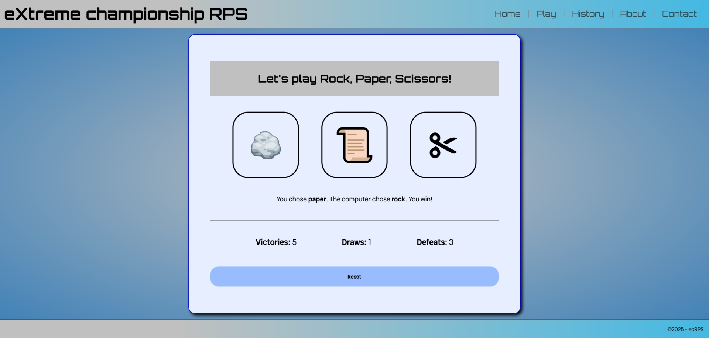

# Rock-Paper-Scissors single-page application

This is my take on the classic beginner programming exercise of making a rock-paper-scissors game. Rather than implementing a standard console application, I attempted to make use of a number of techniques I previously had little experience with in order to add some challenge to this project.

## Table of contents

- [Overview](#overview)
  - [Screenshot](#screenshot)
  - [Links](#links)
- [My process](#my-process)
  - [Built with](#built-with)
  - [Techniques / Concepts](#what-i-learned)
  - [Continued development](#continued-development)
- [Author](#author)

## Overview

### Screenshot

### Links

- Repo URL: <https://github.com/vendkoma/extreme-rps>
- Live Site URL: <https://vendkoma.github.io/extreme-rps/>

## My process

### Built with

- Semantic HTML5 markup
- CSS custom properties
- Flexbox
- JavaScript
- Google Fonts API

### Techniques / Concepts

There were a number of techniques and ideas I wanted to practice with this project, including:

- The various ways of **selecting DOM elements** with JavaScript
- JavaScript **event listeners** and **arrow functions**
- Using JavaScript to **add and remove CSS classes** from DOM objects, primarily for the use of the display property in order to create a single-page application with different tabs
- Converting **HTMLCollection** data extracted from the DOM into an array for use in the JavaScript
- Using JavaScript to modify the **innerHTML** of DOM elements
- **Flexbox** to lay out the navbar and game page
- Loosely following **BEM naming convention** for CSS classes (could be done more strictly)
- CSS **pseudo-elements** to create the separators in the navbar

### Continued development

This project is a rough draft, so there are many improvements that could be made.

Currently this project is not fully responsive, so **media queries**, specifically to adjust the navigation menu and play/game tabs for mobile devices, would be the most impactful change.

The game logic JavaScript could be refactored to be both more concise and readable. The playGame function specifically should likely be divided into multiple functions.

On the history tab, I intentionally included longer text to see how the page would behave with a vertical scrollbar. The scrollbar bumps the nav menu left, which is noticeable when clicking between the tabs. I'm not happy about this effect but I also don't believe it would be a high priority fix.

Cosmetically, the colors and fonts used, lack of images, and layout could all be improved. The goal for this project was not to make it aesthetically pleasing, but doing so would make it more presentable.

Fonts would ideally be self-hosted.

## Author

- GitHub - [@vendkoma](https://github.com/vendkoma)

